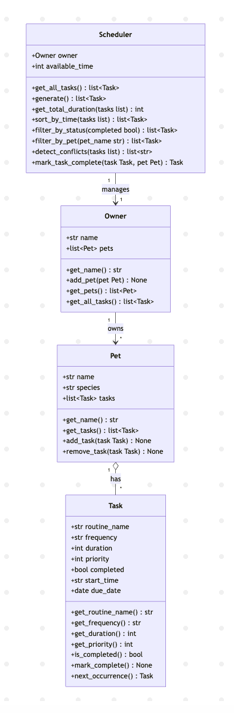

# PawPal+ (Module 2 Project)

You are building **PawPal+**, a Streamlit app that helps a pet owner plan care tasks for their pet.

## Scenario

A busy pet owner needs help staying consistent with pet care. They want an assistant that can:

- Track pet care tasks (walks, feeding, meds, enrichment, grooming, etc.)
- Consider constraints (time available, priority, owner preferences)
- Produce a daily plan and explain why it chose that plan

Your job is to design the system first (UML), then implement the logic in Python, then connect it to the Streamlit UI.

## What you will build

Your final app should:

- Let a user enter basic owner + pet info
- Let a user add/edit tasks (duration + priority at minimum)
- Generate a daily schedule/plan based on constraints and priorities
- Display the plan clearly (and ideally explain the reasoning)
- Include tests for the most important scheduling behaviors

## Getting started

### Setup

```bash
python -m venv .venv
source .venv/bin/activate  # Windows: .venv\Scripts\activate
pip install -r requirements.txt
```

### Suggested workflow

1. Read the scenario carefully and identify requirements and edge cases.
2. Draft a UML diagram (classes, attributes, methods, relationships).
3. Convert UML into Python class stubs (no logic yet).
4. Implement scheduling logic in small increments.
5. Add tests to verify key behaviors.
6. Connect your logic to the Streamlit UI in `app.py`.
7. Refine UML so it matches what you actually built.

## 🖥️ Sample Output

```
Today's Schedule for Jordan's pets
==========================================
  08:00  Feeding             10 min  [high]
  08:10  Morning walk        30 min  [high]
  08:40  Medication           5 min  [high]
  08:45  Play session        25 min  [medium]
  09:10  Grooming            20 min  [low]
==========================================
  Total scheduled: 90 / 90 min
  Tasks scheduled: 5 of 6 available
```

## 🧪 Testing PawPal+

```bash
python -m pytest
```

Tests cover:
- **Task completion** — `mark_complete()` flips status, idempotent on repeat calls
- **Recurring tasks** — daily tasks advance 1 day, weekly advance 7 days, original not mutated
- **Scheduling** — high priority tasks scheduled first, tasks skipped when time runs out
- **Sorting** — tasks returned in chronological order, no `start_time` goes last
- **Filtering** — by pet name and by completion status
- **Conflict detection** — duplicate `start_time` slots flagged, tasks with no time ignored
- **Edge cases** — empty lists, zero available time, unknown pet name, unknown frequency

```
============================= test session starts ==============================
platform darwin -- Python 3.14.6, pytest-8.2.0, pluggy-1.5.0
collected 34 items

tests/test_pawpal.py::test_mark_complete_changes_status PASSED           [  2%]
tests/test_pawpal.py::test_mark_complete_is_idempotent PASSED            [  5%]
tests/test_pawpal.py::test_next_occurrence_daily_advances_one_day PASSED [  8%]
tests/test_pawpal.py::test_next_occurrence_weekly_advances_seven_days PASSED [ 11%]
tests/test_pawpal.py::test_next_occurrence_uses_today_when_no_due_date PASSED [ 14%]
tests/test_pawpal.py::test_next_occurrence_unknown_frequency_returns_none PASSED [ 17%]
tests/test_pawpal.py::test_next_occurrence_does_not_mutate_original PASSED [ 20%]
tests/test_pawpal.py::test_add_task_increases_pet_task_count PASSED      [ 23%]
tests/test_pawpal.py::test_remove_task_decreases_pet_task_count PASSED   [ 26%]
tests/test_pawpal.py::test_remove_task_not_in_list_raises_error PASSED   [ 29%]
tests/test_pawpal.py::test_generate_with_zero_available_time_returns_empty PASSED [ 32%]
tests/test_pawpal.py::test_generate_when_all_tasks_too_long_returns_empty PASSED [ 35%]
tests/test_pawpal.py::test_generate_schedules_high_priority_first PASSED [ 38%]
tests/test_pawpal.py::test_generate_skips_tasks_that_do_not_fit PASSED   [ 41%]
tests/test_pawpal.py::test_get_total_duration_with_no_tasks_returns_zero PASSED [ 44%]
tests/test_pawpal.py::test_sort_by_time_orders_chronologically PASSED    [ 47%]
tests/test_pawpal.py::test_sort_by_time_tasks_without_start_time_go_last PASSED [ 50%]
tests/test_pawpal.py::test_sort_by_time_empty_list_returns_empty PASSED  [ 52%]
tests/test_pawpal.py::test_sort_by_time_all_no_start_time_preserves_relative_order PASSED [ 55%]
tests/test_pawpal.py::test_filter_by_status_returns_only_pending PASSED  [ 58%]
tests/test_pawpal.py::test_filter_by_status_returns_only_completed PASSED [ 61%]
tests/test_pawpal.py::test_filter_by_status_no_matches_returns_empty PASSED [ 64%]
tests/test_pawpal.py::test_filter_by_pet_returns_correct_tasks PASSED    [ 67%]
tests/test_pawpal.py::test_filter_by_pet_unknown_name_returns_empty PASSED [ 70%]
tests/test_pawpal.py::test_filter_by_pet_is_case_sensitive PASSED        [ 73%]
tests/test_pawpal.py::test_filter_by_pet_no_pets_returns_empty PASSED    [ 76%]
tests/test_pawpal.py::test_detect_conflicts_flags_same_start_time PASSED [ 79%]
tests/test_pawpal.py::test_detect_conflicts_no_conflicts_returns_empty PASSED [ 82%]
tests/test_pawpal.py::test_detect_conflicts_ignores_tasks_with_no_start_time PASSED [ 85%]
tests/test_pawpal.py::test_detect_conflicts_no_tasks_returns_empty PASSED [ 88%]
tests/test_pawpal.py::test_mark_task_complete_marks_task_done PASSED     [ 91%]
tests/test_pawpal.py::test_mark_task_complete_adds_next_occurrence_to_pet PASSED [ 94%]
tests/test_pawpal.py::test_mark_task_complete_next_due_date_is_tomorrow PASSED [ 97%]
tests/test_pawpal.py::test_mark_task_complete_unknown_frequency_returns_none PASSED [100%]

============================== 34 passed in 0.04s ==============================
```

**Confidence level: ★★★★☆ (4/5)**
Core scheduling logic, recurring tasks, and edge cases are well covered. Missing: UI integration tests and tests for the full Streamlit session flow.

## 📐 Smarter Scheduling

| Feature | Method(s) | Notes |
|---------|-----------|-------|
| Sort tasks by time | `Scheduler.sort_by_time(tasks)` | Sorts a task list chronologically using `start_time` ("HH:MM" strings). Zero-padding makes lexicographic order identical to chronological order, so no datetime parsing is needed. Tasks with no `start_time` are pushed to the end via a `"99:99"` sentinel. |
| Filter by completion status | `Scheduler.filter_by_status(completed)` | Returns all tasks across every pet whose `completed` flag matches the given boolean. Pass `False` for pending tasks, `True` for finished ones. Single O(n) pass over `get_all_tasks()`. |
| Filter by pet | `Scheduler.filter_by_pet(pet_name)` | Returns the task list for a named pet. Short-circuits on first name match so it never scans more pets than needed. Name matching is case-sensitive. |
| Conflict detection | `Scheduler.detect_conflicts(tasks)` | O(n) detection using a `defaultdict` keyed by `start_time`. Any slot with more than one task is flagged. Returns a list of human-readable warning strings — never raises. Pass a subset to check a specific plan, or omit to check all tasks. |
| Recurring tasks | `Task.next_occurrence()` · `Scheduler.mark_task_complete(task, pet)` | `next_occurrence()` uses `timedelta` to produce a fresh, uncompleted copy of a task due 1 day (daily) or 7 days (weekly) after its current `due_date`. `mark_task_complete()` calls `mark_complete()`, generates the next occurrence, and adds it to the pet automatically. |

## Features

- **Priority-based scheduling** — tasks are sorted by priority (high → medium → low) and fit greedily into the available time window. Tasks that don't fit are skipped and shown separately.
- **Chronological sorting** — after a plan is generated, tasks are sorted by `start_time` ("HH:MM") so the schedule displays in time order. Tasks without a time assigned go last.
- **Conflict detection** — if two tasks share the same `start_time`, the app flags them with a visible warning showing which tasks clash and at what time.
- **Daily recurrence** — marking a daily task complete auto-generates the next occurrence due tomorrow. Weekly tasks push 7 days forward. The original task is never mutated.
- **Status filtering** — tasks can be filtered to show only pending or only completed, giving the owner a clear view of what still needs doing.
- **Per-pet filtering** — tasks can be retrieved for a specific pet by name, useful when an owner has multiple pets.
- **Multi-pet support** — one owner can have multiple pets, each with their own task list. The scheduler aggregates across all pets when building the daily plan.

## 📸 Demo Walkthrough

Run the app:

```bash
streamlit run app.py
```

### UI walkthrough

1. **Step 1 — Owner & Pet Info**: Enter the owner's name, pet name, and species, then click **Save owner & pet**. This creates the `Owner` and `Pet` objects and stores them in session state so data persists across button clicks.

2. **Step 2 — Add Tasks**: Choose which pet to assign the task to. Fill in task name, duration (minutes), priority, and an optional start time (HH:MM format). Click **Add task**. Repeat for as many tasks as needed. A table below shows all current tasks per pet.

3. **Step 3 — Generate Schedule**: Enter how many minutes are available today, then click **Generate schedule**. The app runs `Scheduler.generate()`, assigns start times to each task, sorts chronologically with `sort_by_time()`, and displays the plan as a table. If any tasks share a start time, a conflict warning appears. Tasks that didn't fit are shown in a collapsible "Skipped tasks" section.

4. **Step 4 — View Tasks by Status**: At the bottom of the page, two columns show pending vs completed tasks using `filter_by_status()`. This updates live as tasks are added.

### Example workflow

```
Owner: Jordan   Pets: Mochi (cat), Biscuit (dog)

Add tasks to Mochi:
  - Feeding      | 10 min | high
  - Grooming     | 20 min | low

Add tasks to Biscuit:
  - Morning walk | 30 min | high
  - Medication   |  5 min | high
  - Play session | 25 min | medium
  - Bath         | 40 min | low

Set available time: 90 min → Generate schedule

Result: Feeding, Morning walk, Medication, Play session, Grooming all fit.
        Bath is skipped (would exceed 90 min).
        No conflicts detected (all times are sequential).
```

### CLI output (python main.py)

```
Today's Schedule for Jordan's pets
==========================================
  08:00  Feeding             10 min  [high]
  08:10  Morning walk        30 min  [high]
  08:40  Medication           5 min  [high]
  08:45  Play session        25 min  [medium]
  09:10  Grooming            20 min  [low]
==========================================
  Total scheduled: 90 / 90 min
  Tasks scheduled: 5 of 6 available
```

Bath (40 min, low priority) was dropped because adding it would exceed the 90-minute limit — the greedy scheduler fills highest-priority tasks first and skips anything that no longer fits.

**Screenshot or video** *(optional)*: <!-- Insert a screenshot or link to a demo video here -->

